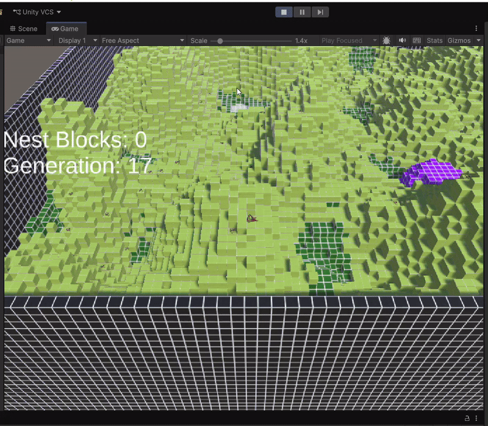

# Assignment 3: Antymology

An evolutionary simulation where artificial ant colonies compete to build the largest nests through emergent behavior and adaptation.

## Overview

This project simulates a colony of ants in a 3D terrain environment, where ants must learn to forage, survive, and transfer health to their queen who constructs nests (the ultimate metric we are trying to increase). Ants evolve strategies through an evolutionary algorithm that rewards successful nest construction. The system demonstrates how complex group behaviors can emerge from simple individual rules and evolutionary pressure.

## How It Works

Each ant carries a genome that encodes its behavioral biases. At every timestep, an ant evaluates its available moves and scores them based on its genetic weighting of various environmental factors. The ant can move in four directions or stay in place, but cannot move to a block more than 2 units higher or lower in elevation.

**Genetic Traits**: Each ant's genome defines weights for key decision factors: how strongly it seeks food (mulch blocks), how much it avoids acidic terrain, whether it prefers crowded or solo areas, how desperate it becomes when health is low, its attraction to the queen, and its willingness to share health with the queen. These genetic traits directly influence movement decisions.

**Survival & Energy**: Ants lose health every timestep and must find mulch blocks to refill their reserves. They occupy individual tiles and consume resources. Workers can share health with the queen to keep the colony's leader alive and building nests, while the queen herself produces nest blocks at a substantial metabolic cost (1/3 of her maximum health per block).

**Movement & Pathfinding**: Rather than following a predetermined path, ants make local movement decisions based on limited vision. They can detect nearby mulch, acidic blocks, other ants, and the queen's location from a distance. This information is weighted by their genome to produce a movement score for each available option. A worker with high food-seeking genetics will be drawn toward mulch, while one with strong acid-avoidance will steer clear of hazardous terrain.

**Evolution**: The simulation keeps continuing through generations. Ants' fitness is calculated based metrics like on how long they survive and how much health they contribute to the queen, and the fittest ants have their genes passed to the next generation, with mutations introducing variation. Over time, populations should develop strategies that balance exploration, resource gathering, and cooperation around the queen.

When running the application, you observe the current generation and you can see the generation number and the number of nests built by the queen so far. A new generation starts when the queen dies or 150 timesteps have passed, at which point the fittest ants are selected to reproduce and create the next generation of ants with inherited traits.